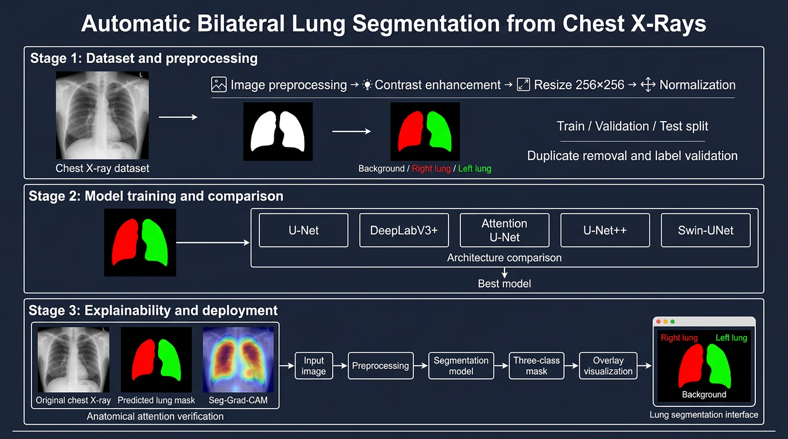

# chest-xray-lung-segmentation

## About

A reliable diagnosis of lung pathologies from chest X-rays (CXR) requires precisely isolating the region of interest, which is often cluttered by non-lung elements (ribs, artifacts, orientation letters). This project proposes an **automatic bilateral lung segmentation** (right lung / left lung distinguished), as a preliminary step before any lung pathology analysis.

Several semantic segmentation architectures were compared to select the best-performing one — validated with **Seg-Grad-CAM** to confirm that it relies on actual lung anatomy.

---
## Dataset

For this project, we use the [COVID-19 Radiography Database](https://www.kaggle.com/datasets/tawsifurrahman/covid19-radiography-database). This comprehensive database contains chest X-ray images divided into four distinct classes: COVID-19, normal, lung opacity (Lung_Opacity), and viral pneumonia. Specifically, the dataset includes 3,616 images of COVID-19-positive cases, 10,192 images classified as normal, 6,012 images of lung opacity, and 1,345 images identified as viral pneumonia. This extensive collection allows our diagnostic models to be trained effectively, ensuring robust performance in identifying and classifying these pathologies.

| Class | Number of images |
|---|---|
| COVID | 3616 |
| Normal | 10192 |
| Lung_Opacity | 6012 |
| Viral Pneumonia | 1345 |

---
## How to run the notebook

### Prerequisites
Before you start, make sure you have a Kaggle account or access to Google Colab, as well as Python 3 installed if you run the notebook locally.

* **Step 1: Download the dataset**
   * Download the [COVID-19 Radiography Database](https://www.kaggle.com/datasets/tawsifurrahman/covid19-radiography-database).
   * The dataset must include the images and masks for COVID-19, Lung Opacity, Normal, and Viral Pneumonia.
* **Step 2: Set up your environment**
   * Kaggle: import the dataset into your Kaggle account and use it in a new notebook.
   * Google Colab: upload the dataset to Google Drive, mount the drive in Colab, and update the paths accordingly.
* **Step 3:** Update the dataset paths in the notebook according to your environment setup.
* **Step 4:** Run all cells.
---

## Methodology

- Stratified split: 70% train, 15% validation, and 15% test.
- Duplicate removal before splitting the data.
- Preprocessing: percentile normalization, CLAHE, resizing to 256×256, and Z-score normalization.
- Normalization statistics are computed only on the training set.
- Augmentation applied only to the training data (horizontal flip disabled).
- Models compared: U-Net, DeepLabV3+, Attention U-Net, and U-Net++.
- Pretrained encoders tested: ResNet34 and EfficientNet-B4.
- Loss function: combination of Dice Loss and Cross-Entropy.
- Hyperparameter optimization with Optuna TPE.
- Training with Adam, AMP, early stopping, and best-checkpoint saving.
- Metrics: Dice, IoU, and pixel accuracy.

  
The model is selected based on validation performance. The test set is reserved for final evaluation.

Full details (functions, per-epoch checkpointing, regularization): see [`docs/methodology.md`](docs/methodology.md).

## Results

### Results — From scratch (without pretrained encoder)

For comparison, the same architectures qre trained **from scratch**, without ImageNet pretrained weights:

| Rank | Architecture | Right Dice | Left Dice | Mean Dice |
|:---:|---|---:|---:|---:|
| 1 | **U-Net** | **0.9864** | **0.9847** | **0.9856** |
| 2 | DeepLabV3 | 0.9864 | 0.9842 | 0.9853 |
| 3 | Attention U-Net | 0.9861 | 0.9837 | 0.9849 |
| 4 | U-Net++ | 0.9859 | 0.9834 | 0.9847 |

> **Best from-scratch model: U-Net** — Mean Dice = 0.9856

Comparison of the architectures and encoders tested (test metrics, sorted by decreasing performance):

| Rank | Model | Encoder | Dice coef | IoU score | Pixel accuracy |
|:---:|---|---|---:|---:|---:|
| 1 | **U-Net++** | resnet34 | **0.9893** | **0.9792** | **0.9954** |
| 2 | Attention U-Net | resnet34 | 0.9891 | 0.9780 | 0.9963 |
| 3 | U-Net | resnet34 | 0.9889 | 0.9784 | 0.9953 |
| 4 | U-Net++ | efficientnet-b4 | 0.9888 | 0.9784 | 0.9953 |
| 5 | U-Net | efficientnet-b4 | 0.9886 | 0.9779 | 0.9952 |
| 6 | DeepLabV3+ | resnet34 | 0.9885 | 0.9777 | 0.9951 |
| 7 | DeepLabV3+ | efficientnet-b4 | 0.9883 | 0.9773 | 0.9950 |
| 7 | Attention U-Net | efficientnet-b4 | 0.9883 | 0.9773 | 0.9950 |

> **Note méthodologique** : Dice coef et IoU score correspondent à la moyenne des scores *hard* (argmax) du poumon droit et du poumon gauche, calculée sur le jeu de test. Pixel accuracy est reportée telle quelle depuis l'évaluation sur le test set. Les rangs 7 sont ex æquo (valeurs identiques à la précision affichée).

> **Note méthodologique** : Dice coef et IoU score correspondent à la moyenne des scores *hard* (argmax) du poumon droit et du poumon gauche, calculée sur le jeu de test. Pixel accuracy est reportée telle quelle depuis l'évaluation sur le test set.
> **Best model: U-Net++ (resnet34)** — Dice coef = 0.9893 · IoU score = 0.9786 · Pixel accuracy = 0.9953

## Explainability

- **Worst-case inspection**: visualization of test images with the lowest Lung Dice, to visually confirm that the high aggregate scores are credible and don't hide a metric/label bug.
- **Error maps**: visualization of false positives / false negatives relative to ground truth.
- **Seg-Grad-CAM**: A Seg-Grad-CAM analysis is used to verify that the model focuses primarily on lung regions rather than on artifacts such as:

- orientation letters;
- image edges;
- external elements;
- medical devices.

## Deployment

A Streamlit application allows the user to:

1. upload a chest X-ray;
2. apply the same preprocessing used during training;
3. generate the lung mask;
4. display a colored overlay of the right and left lungs.

## Project Structure

```text
lung-segmentation-app/
├── app/
│   ├── app.py
│   ├── config.py
│   ├── model.py
│   ├── model_utils.py
│   └── preprocessing.py
├── checkpoints/
├── notebooks/
├── docs/
│   └── methodology.md
├── streamlit_app.py
├── requirements.txt
└── README.md
```

## Installation

```bash
git clone https://github.com/<your-username>/lung-segmentation-app.git
cd lung-segmentation-app

python -m venv venv
source venv/bin/activate        # Linux/macOS
venv\Scripts\activate           # Windows

pip install -r requirements.txt
```

## Run the Application

```bash
streamlit run streamlit_app.py
```

## Limitations

- Patient IDs are not available, so patient-level leakage cannot be fully ruled out.
- Some reference masks may contain inaccuracies or annotation errors.
- Performance has not yet been verified on an external dataset.
- The model is intended for research and image preprocessing purposes, not for standalone clinical use.

## Limitations & Future Improvements

- **Patient-level leakage not fully ruled out**: the dataset does not provide a patient identifier; only image-level leakage (duplicates/near-duplicates) is guaranteed to be absent.
- **No systematic L2 penalty** on the from-scratch models.
- **Horizontal flip disabled** by methodological choice (real thoracic asymmetry) — could be reevaluated with lighter/probabilistic augmentation.
- Ideas for future work: cross-validation, testing on an external dataset not seen during development, quantization/ONNX export for deployment.

## Author

Wijdane Abouzaid — Final Year Project (PFA), ENSIASD Taroudant, AI & Data Engineering specialty.
